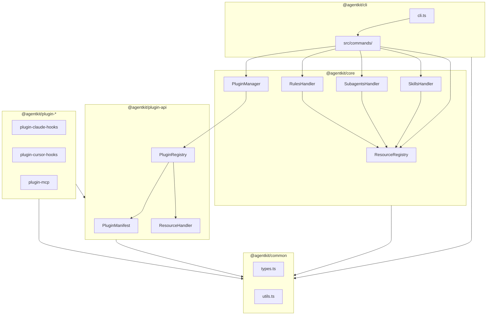

# Contributing to AgentKit

Thank you for your interest in contributing to **AgentKit** (formerly `coding-agent-fabric`)! This guide will help you set up your development environment and understand our workflow.

## Prerequisites

Before you begin, ensure you have the following installed:

- **Node.js**: >=24.13.0 (See [.node-version](.node-version))
- **pnpm**: >=10.28.1 (See [package.json](package.json))
- **Trunk**: For linting and formatting (managed hermetically)

## Getting Started

1.  **Clone the repository**:

    ```bash
    git clone https://github.com/yu-iskw/agentkit.git
    cd agentkit
    ```

2.  **Install dependencies**:

    ```bash
    pnpm install
    ```

3.  **Build the project**:

    ```bash
    pnpm build
    ```

4.  **Check installation health**:
    ```bash
    # Check installation health and detected agents
    pnpm --filter @agentkit/cli dev doctor
    ```

## Workspace Layout

The project is a monorepo managed with pnpm workspaces.

<!-- SYNC:LAYOUT -->

```text
packages/
  cli            # Command-line interface (@agentkit/cli)
  common         # Shared types and utilities (@agentkit/common)
  core           # Core logic and resource registry (@agentkit/core)
  plugin-api     # Plugin API and base interfaces (@agentkit/plugin-api)
  plugins/
    claude-code-hooks # Plugin for Claude Code hooks (@agentkit/plugin-claude-hooks)
    cursor-hooks      # Plugin for Cursor hooks (@agentkit/plugin-cursor-hooks)
    mcp               # Plugin for MCP server management (@agentkit/plugin-mcp)
```

<!-- /SYNC:LAYOUT -->

## Development Workflow

### Architecture Overview

<!-- SYNC:ARCHITECTURE -->



<!-- /SYNC:ARCHITECTURE -->

### Common Commands

<!-- SYNC:SCRIPTS -->

- **build**: `pnpm --recursive build`
- **clean**: `rimraf "packages/**/dist"`
- **format**: `pnpm format:trunk`
- **format:all**: `pnpm format:trunk-all`
- **format:eslint**: `eslint . --fix`
- **format:prettier**: `prettier --write .`
- **format:trunk**: `trunk fmt`
- **format:trunk-all**: `trunk fmt --all`
- **lint**: `pnpm lint:trunk && pnpm lint:eslint`
- **lint:all**: `pnpm lint:trunk-all && pnpm lint:eslint`
- **lint:eslint**: `eslint .`
- **lint:security**: `trunk check --all --scope security`
- **lint:trunk**: `trunk check -y`
- **lint:trunk-all**: `trunk check --all -y`
- **test**: `vitest run`
- **test:integration**: `make -C integration_tests test`

<!-- /SYNC:SCRIPTS -->

### Adding Dependencies

- To a specific package: `pnpm add <pkg> --filter <package-name>`
- As a dev dependency: `pnpm add -D <pkg> --filter <package-name>`
- To the workspace root: `pnpm add -w <pkg>`

## Code Style & Standards

- **TypeScript**: Use TypeScript for all code.
- **Naming Conventions**:
  - `PascalCase` for classes and interfaces.
  - `camelCase` for functions and variables.
  - `kebab-case` for file names (e.g., `user-service.ts`).
- **Patterns**: Use functional programming patterns where appropriate.
- **Formatting**: We use Trunk to manage ESLint and Prettier. Run `pnpm format` before committing.

## Testing

- Write tests in `tests/` directories or alongside source files as `*.test.ts`.
- Use Vitest for unit and integration tests.
- Aim for high test coverage on core logic.
- Run `pnpm test` before committing.

## Git Workflow

1.  **Branching**: Create feature branches from `main`.
2.  **Commits**: Use the conventional commits format: `type(scope): description`.
    - Types: `feat`, `fix`, `docs`, `style`, `refactor`, `test`, `chore`.
3.  **Pull Requests**: Ensure all tests and linters pass before opening a PR.

---

_This guide is based on our [CLAUDE.md](CLAUDE.md) project memory._
